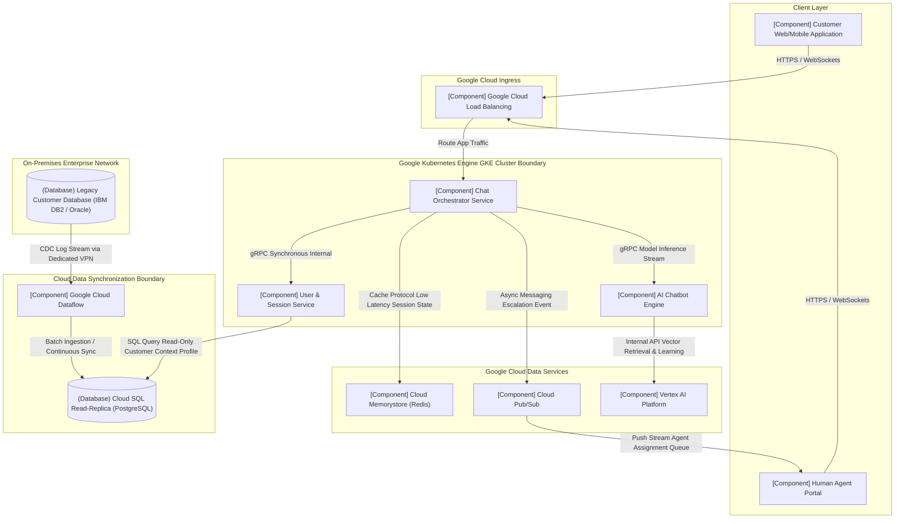

<h1>Component & Integration Diagram</h1>

```mermaid
graph TD
    %% =========================================================================
    %% ARCHITECTURAL NOTE: MAJOR SYSTEM MODULES, BOUNDARIES, & RELATIONSHIPS
    %% The system uses Google Kubernetes Engine (GKE) to establish clear component 
    %% boundaries, separating ingress, web applications, core business orchestrators, 
    %% and AI inference logic to optimize for 10,000 concurrent users.
    %% =========================================================================

    %% External Clients Layer Boundary
    subgraph ClientLayer [Client Layer]
        ClientApp["[Component] Customer Web/Mobile Application"]
        AgentPortal["[Component] Human Agent Portal"]
    end

    %% Public Ingress Boundary
    subgraph IngressLayer [Google Cloud Ingress]
        GCLB["[Component] Google Cloud Load Balancing"]
    end

    %% Core Managed Compute Container Boundary
    subgraph GKELayer [Google Kubernetes Engine GKE Cluster Boundary]
        UserSvc["[Component] User & Session Service"]
        Orchestrator["[Component] Chat Orchestrator Service"]
        AIEngine["[Component] AI Chatbot Engine"]
    end

    %% Fully Managed Cloud Data Subsystems
    subgraph DataServices [Google Cloud Data Services]
        RedisCache["[Component] Cloud Memorystore (Redis)"]
        PubSub["[Component] Cloud Pub/Sub"]
        VertexAI["[Component] Vertex AI Platform"]
    end

    %% =========================================================================
    %% EXTERNAL SYSTEM CONNECTIONS: HYBRID CLOUD TO ON-PREMISES INTEGRATION
    %% The legacy system is isolated via a secure Google Cloud Interconnect/VPN.
    %% Data synchronization happens asynchronously using a Cloud Dataflow pipeline 
    %% feeding a read-replica database instance within Google Cloud.
    %% =========================================================================
    subgraph CloudSyncBoundary [Cloud Data Synchronization Boundary]
        Dataflow["[Component] Google Cloud Dataflow"]
        CloudSQL[("(Database) Cloud SQL Read-Replica (PostgreSQL)")]
    end

    subgraph OnPremNetwork [On-Premises Enterprise Network]
        OnPremDB[("(Database) Legacy Customer Database (IBM DB2 / Oracle)")]
    end

    %% =========================================================================
    %% DATA FLOW PATHS & INTERACTION POINTS
    %% Straight paths map synchronous runtime interactions (gRPC), entry ingress 
    %% routes (HTTPS/WSS), and asynchronous event messaging.
    %% =========================================================================
    
    %% Ingress and Client Flows
    ClientApp -->|HTTPS / WebSockets| GCLB
    AgentPortal -->|HTTPS / WebSockets| GCLB
    GCLB -->|Route App Traffic| Orchestrator
    
    %% Core Orchestration & Session Storage Interaction Points
    Orchestrator -->|gRPC Synchronous Internal| UserSvc
    Orchestrator -->|Cache Protocol Low Latency Session State| RedisCache
    
    %% AI Feature Integration Flow Path
    Orchestrator -->|gRPC Model Inference Stream| AIEngine
    AIEngine -->|Internal API Vector Retrieval & Learning| VertexAI
    
    %% Asynchronous Escalation Flow Path
    Orchestrator -->|Async Messaging Escalation Event| PubSub
    PubSub -->|Push Stream Agent Assignment Queue| AgentPortal

    %% Hybrid Integration Data Flow Pipeline
    OnPremDB -->|CDC Log Stream via Dedicated VPN| Dataflow
    Dataflow -->|Batch Ingestion / Continuous Sync| CloudSQL
    UserSvc -->|SQL Query Read-Only Customer Context Profile| CloudSQL
```
