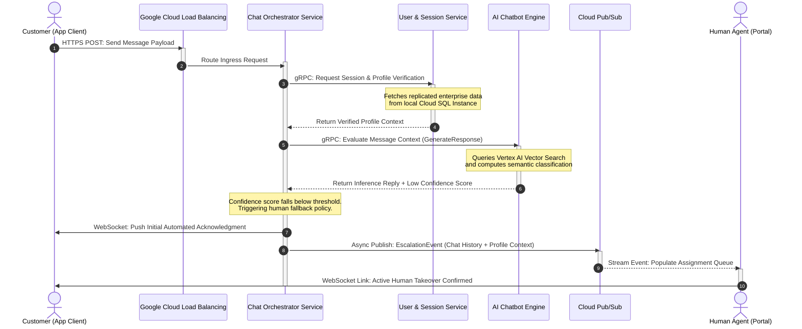

<h1>Runtime Sequence Diagram</h1>

```mermaid
sequenceDiagram
    autonumber
    actor Customer as Customer (App Client)
    participant GCLB as Google Cloud Load Balancing
    participant Orch as Chat Orchestrator Service
    participant UserSvc as User & Session Service
    participant AI as AI Chatbot Engine
    participant PubSub as Cloud Pub/Sub
    actor Agent as Human Agent (Portal)

    %% Step 1-3: Initialization & Ingress Validation
    Customer->>GCLB: HTTPS POST: Send Message Payload
    activate GCLB
    GCLB->>Orch: Route Ingress Request
    activate Orch
    deactivate GCLB
    
    %% Step 4-6: Contextual Hydration via Synced Read-Replica
    Orch->>UserSvc: gRPC: Request Session & Profile Verification
    activate UserSvc
    Note over UserSvc: Fetches replicated enterprise data<br/>from local Cloud SQL Instance
    UserSvc-->>Orch: Return Verified Profile Context
    deactivate UserSvc

    %% Step 7-10: AI Feature Integration Loop
    Orch->>AI: gRPC: Evaluate Message Context (GenerateResponse)
    activate AI
    Note over AI: Queries Vertex AI Vector Search<br/>and computes semantic classification
    AI-->>Orch: Return Inference Reply + Low Confidence Score
    deactivate AI

    %% Step 11-14: Asynchronous Escalation Pathway
    Note over Orch: Confidence score falls below threshold.<br/>Triggering human fallback policy.
    Orch->>Customer: WebSocket: Push Initial Automated Acknowledgment
    Orch->>PubSub: Async Publish: EscalationEvent (Chat History + Profile Context)
    activate PubSub
    PubSub-->>Agent: Stream Event: Populate Assignment Queue
    deactivate PubSub
    activate Agent
    Agent->>Customer: WebSocket Link: Active Human Takeover Confirmed
    deactivate Orch
    deactivate Agent
```
